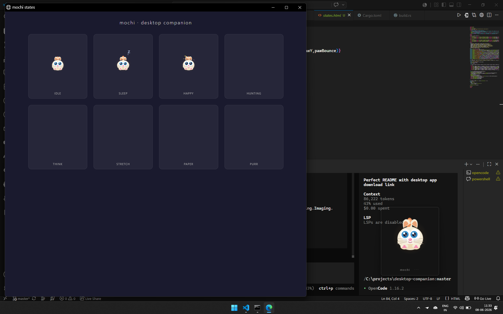

<p align="center">
  
</p>

<h1 align="center">mochi</h1>

<p align="center">
  <b>An open-source desktop companion animal</b><br>
  A tiny creature that lives on your screen — keeping you company, tracking your focus,<br>
  reminding you to drink water, and reacting to everything you do.
</p>

<p align="center">
  <a href="https://github.com/charansaiponnada/desktop-companion/releases"><strong>⬇️ Download for Windows &middot; macOS &middot; Linux</strong></a>
</p>

<p align="center">
  
  
  
</p>

<p align="center">
  
</p>

---

## What is mochi?

mochi is a lightweight, always-on-top desktop pet that lives at the edge of your screen. It reacts to your keyboard, mouse, and activity patterns with over a dozen fluid animations — idle, sleep, type, stretch, hunt the cursor, purr when petted, and even overheat when you type too long.

Choose between a **cat** (calm, slightly aloof) or a **fox** (curious, energetic). Each has its own personality, speech patterns, and transition behaviors.

## Features

- **Always-on-top companion** — stays visible while you work, play, or browse
- **Transparent window** — blends into any desktop background
- **16+ animation states** — idle, sleep, typing, hunting, stretching, jumping, purring, drag, paper, overheat, and more
- **2 avatars** — Cat (calm, aloof) and Fox (curious, energetic)
- **Activity-aware** — reacts to typing, mouse movement, bursts, and idle time
- **Speech bubbles** — personality-driven messages based on context
- **Pomodoro timer** — focus session tracking with break reminders
- **Water reminders** — hydration nudges throughout the day
- **Daily summarizer** — recaps your activity at the end of the day
- **Drag & drop** — grab and move mochi anywhere on screen
- **AI-powered** (optional) — smarter messages via local Ollama + Llama 3.2
- **Customizable fur colors** — personalize your companion's appearance

## Download

| Platform | Download |
|----------|----------|
| **Windows** | `.msi` installer from [Releases](https://github.com/charansaiponnada/desktop-companion/releases) |
| **macOS** | `.dmg` from [Releases](https://github.com/charansaiponnada/desktop-companion/releases) |
| **Linux** | `.AppImage` or `.deb` from [Releases](https://github.com/charansaiponnada/desktop-companion/releases) |

⬇️ **[Download v0.1.0](https://github.com/charansaiponnada/desktop-companion/releases/tag/v0.1.0)** — the first stable release is live.

Or build from source below.

## Quick start (from source)

```bash
# Prerequisites: Rust, Node.js 20+
git clone https://github.com/charansaiponnada/desktop-companion.git
cd desktop-companion
npm install
npm run tauri:dev
```

See [SETUP.md](SETUP.md) for platform-specific prerequisites (Rust, C++ Build Tools, WebView2) and [windows-setup.md](windows-setup.md) for Windows-specific guidance.

To build a release binary:

```bash
npm run tauri:build
```

Output is in `src-tauri/target/release/bundle/`.

## Anatomy

```
mochi/
├── src/
│   ├── App.jsx                   entry point
│   ├── main.jsx                  React root
│   ├── core/
│   │   ├── stateMachine.js       event → state transitions
│   │   ├── inputMonitor.js       mouse/keyboard watcher
│   │   ├── pomodoro.js           focus timer
│   │   └── waterReminder.js      hydration nudges
│   ├── avatars/
│   │   ├── cat/behaviors.json    cat personality + transitions
│   │   └── fox/behaviors.json    fox personality + transitions
│   ├── ai/
│   │   ├── brain.js              Ollama wrapper + template fallback
│   │   └── summarizer.js         daily activity summarizer
│   ├── memory/
│   │   └── store.js              SQLite interface (via Tauri invoke)
│   └── ui/
│       ├── Companion.jsx         canvas renderer + wiring
│       ├── mochi.js              mochi the cat — canvas drawing functions
│       └── Settings.jsx          settings panel
├── src-tauri/
│   ├── src/main.rs               Rust backend: window, DB commands
│   ├── Cargo.toml
│   └── tauri.conf.json           window config: transparent, always-on-top
└── package.json
```

## Controls

| Input | Action |
|-------|--------|
| **P** key | Pet (purr) |
| **Space** | Pet (purr) |
| **Double-click** pet | Pet (purr) |
| **Right-click** pet | Pet (purr) |
| **Pet button** below canvas | Pet (purr) |
| **W** key | Stretch (pomodoro break) |
| **R** key | Celebrate (jump) |
| **T** key | Think (AI thinking) |
| **Drag** | Grab and move mochi anywhere |

## Avatars

### Cat
> *Calm, slightly aloof. Knocks things off. Slow blinks. Ignores you sometimes.*

Speech frequency: low, silence chance: 40%. Idles after 5 minutes of inactivity.

### Fox
> *Curious, alert, energetic. Ears perk on events. Head-tilts. Pays close attention.*

Speech frequency: medium, silence chance: 15%. Idles after 7 minutes of inactivity.

## Animations

| State | Trigger | Description |
|-------|---------|-------------|
| `idle` | default | Gentle breathing, tail sway, occasional ear perk |
| `sleep` | idle timeout | Curled up, slow breathing, floating Zzz |
| `typing` | key presses | Paw-tapping animation |
| `hunting` | fast mouse | Cursor tracking mode |
| `stretch` | pomodoro break | Full body stretch with paws up |
| `jump` | task complete / AI done | Happy celebration hop |
| `purr` | pet event | Contented purr with floating hearts |
| `think` | AI processing | Head tilt, thought bubbles, whisker twitch |
| `overheat` | prolonged typing | Steam rising from overworked companion |
| `drag` | drag start | Slightly squished while being carried |
| `paper` | scroll event | Unrolling scroll animation |
| `surprised` | key burst | Wide eyes, perked ears |
| `excited` | special event | Bouncing, sparkling, maximum wag |
| `happy` | general | Happy bounce with sparkles |
| `wag` | tail wag | Focused tail wag, happy mouth |
| `walk` / `run` | movement | Animated gait with paw steps |

## AI (optional)

mochi can use a local LLM for smarter, context-aware messages:

```bash
# Install Ollama
ollama pull llama3.2
ollama serve
```

Without Ollama, mochi uses built-in personality templates.

## Building a custom avatar

See [SETUP.md](SETUP.md#adding-a-new-avatar) for a step-by-step guide on creating and registering new avatars.

## Built with

- [Tauri 2](https://v2.tauri.app/) — cross-platform desktop shell
- [React 18](https://react.dev/) — UI framework
- [Vite 5](https://vitejs.dev/) — build tool
- [Rust](https://www.rust-lang.org/) — backend (rusqlite, serde)
- [Ollama](https://ollama.com/) — optional local AI
- [Canvas API](https://developer.mozilla.org/en-US/docs/Web/API/Canvas_API) — all rendering (zero image assets)

---

<p align="center">
  <a href="https://github.com/charansaiponnada/desktop-companion/releases">Download</a> &middot;
  <a href="SETUP.md">Setup Guide</a> &middot;
  <a href="https://github.com/charansaiponnada/desktop-companion/issues">Report a bug</a>
</p>
